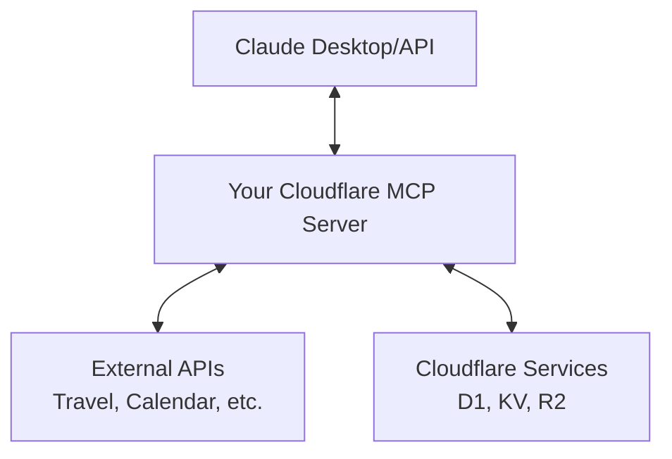

# Understanding MCP Fundamentals

Before we dive into building MCP servers with Cloudflare, let's understand the core concepts and architecture that make the Model Context Protocol powerful.

## 🏗️ MCP Architecture Overview

The Model Context Protocol follows a client-server architecture where your MCP server will fit into a broader ecosystem:



### Key Components in Your Workshop Context:

#### **🤖 MCP Host (Claude)**
- **Your AI Interface**: Claude Desktop, Claude API, or other MCP-compatible clients
- **Initiates conversations** and decides when to call your tools
- **Manages user permissions** and consent for tool execution

#### **🔌 MCP Client** 
- **Built into Claude**: Handles the MCP protocol communication
- **Negotiates capabilities** with your MCP server
- **Sends tool requests** and processes responses

#### **⚡ Your MCP Server**
- **Runs on Cloudflare Workers**: Globally distributed, serverless execution
- **Exposes tools** that Claude can call (flight search, restaurant booking, etc.)
- **Connects to external APIs** and data sources
- **Returns structured responses** back to Claude

#### **🌐 External Integrations**
- **APIs**: Travel services, calendar systems, booking platforms
- **Cloudflare Services**: D1 Database, KV Storage, R2 Object Storage
- **Authentication**: OAuth flows, API keys managed securely

## 🔄 Information Flow in Your Workshop

Here's how a typical interaction flows through your MCP server:

1. **User Request**: "Book me a restaurant for Friday night"
2. **Claude Analysis**: Determines it needs to use your restaurant booking tool
3. **MCP Tool Call**: Claude calls your Cloudflare Workers endpoint
4. **Server Processing**: Your worker queries OpenTable API, checks availability
5. **Response**: Structured data returned to Claude
6. **User Experience**: Claude presents booking options and confirmations

## 🛠️ Server Features You'll Build

Your MCP server can provide these core features:

### **⛏️ Tools** (What you'll focus on)
Functions that Claude can execute to perform specific tasks:

```typescript
// Example: Restaurant search tool
server.tool("searchRestaurants", {
  location: z.string().describe("City or address to search"),
  date: z.string().describe("Date in YYYY-MM-DD format"),
  partySize: z.number().describe("Number of people")
}, async ({ location, date, partySize }) => {
  // Your MCP server logic here
  const restaurants = await searchRestaurantsAPI(location, date, partySize);
  return { restaurants };
});
```

### **📑 Resources** (Optional enhancement)
Contextual data that Claude can reference:
- User preferences stored in Cloudflare KV
- Restaurant favorites or booking history
- Travel itineraries from previous bookings

### **🤖 Prompts** (Advanced feature)
Pre-defined conversation templates:
- Booking confirmation workflows
- Travel planning conversation starters
- Meeting summary templates

## 🚀 Why Cloudflare for MCP?

Your workshop leverages Cloudflare because it's perfect for MCP servers:

- **Global Edge Deployment**: Low latency responses to Claude
- **Serverless Scale**: Handle varying loads automatically
- **Built-in Security**: DDoS protection, secure environment variables
- **Easy Integration**: Simple HTTP endpoints that Claude can call
- **Cost Effective**: Pay per request, perfect for MCP tool usage patterns

---

**Ready to build?** Now that you understand how MCP works, let's dive in [and build your server](./getting-started.md)!
